

Microservices architecture

Before the hands-on lab setup guide

June 2019

Information in this document, including URL and other Internet Web site references, is subject to change without notice. Unless otherwise noted, the example companies, organizations, products, domain names, e-mail addresses, logos, people, places, and events depicted herein are fictitious, and no association with any real company, organization, product, domain name, e-mail address, logo, person, place or event is intended or should be inferred. Complying with all applicable copyright laws is the responsibility of the user. Without limiting the rights under copyright, no part of this document may be reproduced, stored in or introduced into a retrieval system, or transmitted in any form or by any means (electronic, mechanical, photocopying, recording, or otherwise), or for any purpose, without the express written permission of Microsoft Corporation.

Microsoft may have patents, patent applications, trademarks, copyrights, or other intellectual property rights covering subject matter in this document. Except as expressly provided in any written license agreement from Microsoft, the furnishing of this document does not give you any license to these patents, trademarks, copyrights, or other intellectual property.

The names of manufacturers, products, or URLs are provided for informational purposes only and Microsoft makes no representations and warranties, either expressed, implied, or statutory, regarding these manufacturers or the use of the products with any Microsoft technologies. The inclusion of a manufacturer or product does not imply endorsement of Microsoft of the manufacturer or product. Links may be provided to third party sites. Such sites are not under the control of Microsoft and Microsoft is not responsible for the contents of any linked site or any link contained in a linked site, or any changes or updates to such sites. Microsoft is not responsible for webcasting or any other form of transmission received from any linked site. Microsoft is providing these links to you only as a convenience, and the inclusion of any link does not imply endorsement of Microsoft of the site or the products contained therein.

© 2019 Microsoft Corporation. All rights reserved.

Microsoft and the trademarks listed at <https://www.microsoft.com/en-us/legal/intellectualproperty/Trademarks/Usage/General.aspx> are trademarks of the Microsoft group of companies. All other trademarks are property of their respective owners.

**Contents**

<!-- TOC -->

- [Microservices architecture before the hands-on lab setup guide](#microservices-architecture-before-the-hands-on-lab-setup-guide)
    - [Requirements](#requirements)
    - [Before the hands-on lab](#before-the-hands-on-lab)
        - [Task 1: Provision Service Fabric Cluster](#task-1-provision-service-fabric-cluster)
        - [Task 2: Provision a lab virtual machine (VM)](#task-2-provision-a-lab-virtual-machine-vm)
        - [Task 3: Connect to your lab VM](#task-3-connect-to-your-lab-vm)
        - [Task 4: Install Chrome on LabVM](#task-4-install-chrome-on-labvm)
        - [Task 5: Install Docker for Windows on LabVM](#task-5-install-docker-for-windows)
        - [Task 6: Install Service Fabric SDK for Visual Studio](#task-5-install-service-fabric-sdk-for-visual-studio)
        - [Task 7: Setup Service Fabric certificate](#task-6-setup-service-fabric-certificate)
        - [Task 8: Validate Service Fabric ports](#task-7-validate-service-fabric-ports)

<!-- /TOC -->

# Microservices architecture before the hands-on lab setup guide 

## Requirements

1.  Microsoft Azure subscription must be pay-as-you-go or MSDN

    -   Trial subscriptions will not work.

2.  A virtual machine configured with:

    -   Visual Studio 2019 Community edition, or later

    -   Azure Development workload enabled in Visual Studio 2019 (enabled by default on the VM)

    -   Service Fabric SDK 3.3 or later for Visual Studio
    
    -   Google Chrome browser (Swagger commands do not work in IE)
    
    -   Docker for Windows

    -   PowerShell 3.0 or higher (v5.1 already installed on VM)

## Before the hands-on lab

Duration: 50 minutes

Synopsis: In this exercise, you will set up your environment for use in the rest of the hands-on lab. You should follow all the steps provided in the Before the hands-on lab section to prepare your environment before attending the hands-on lab.

>**IMPORTANT**: Most Azure resources require unique names. Throughout these steps, you will see the word "SUFFIX" as part of resource names. You should replace this with your Microsoft alias, initials, or other value to ensure the resource is uniquely named.

### Task 1: Provision Service Fabric Cluster

In this task, you will provision the Service Fabric Cluster in Azure.

1.  In the Azure portal, select +Create a Resource, then type "Service Fabric" into the Search the Marketplace box. Select Service Fabric Cluster from the results.

    

2.  On the Service Fabric Cluster blade, select Create.

3.  On the Basics blade of the Create Service Fabric cluster screen, enter the following:

-   Cluster name: Enter **contosoeventssf-SUFFIX**, replacing SUFFIX with your alias, initials, or another value to make the name unique (indicated by a green check in the text box).

-   Operating system: Set to **UbuntuServer 16.04 LTS**

-   Username: Enter **holuser**.

-   Password: Enter **Password.1!!**

-   Subscription: Select the subscription you are using for this lab.

-   Resource Group: Select Create new, and enter **hands-on-lab** for the resource group name. You can add -SUFFIX, if needed to make resource group name unique. This is the resource group you will use for all resources you create for this hands-on lab.

-   Location: Select the region to use. Select the closest region to your current location.

-   Select OK.

    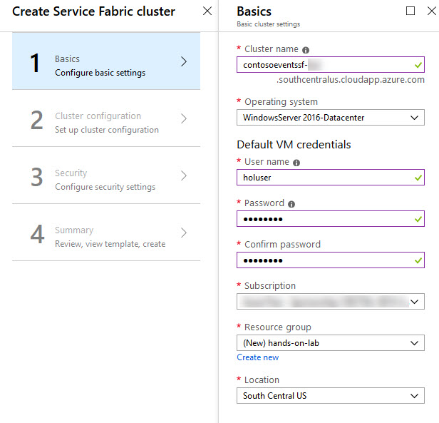

4.  On the Cluster configuration blade, set the following:

-   Node type count: **Select 1**.

-   Node type 1 (Primary): **Select to configure required settings**. On the Node type configuration blade enter:

    -   Node type name: Enter **Web**.

    -   Durability tier: Leave **Bronze** selected.

    -   Virtual machine size: Select a VM size of **D1\_V2 Standard** and select Select on the Choose a size blade.

        
       

    -   Single node cluster: Leave unchecked.

    -   Initial VM scale set capacity: Leave set to **5**.

    -   Custom endpoints: Enter **8082, 8083**. This will allow the microservices to be accessible through the cluster.

    -   Configure advanced settings: Leave unchecked.

    -   Select OK on the Node type configuration blade.

    -   Select OK on the Cluster configuration blade.

    

5.  On the Security blade, you can provide security settings for your cluster. This configuration is completed up front, cannot be changed later. Set the following:

-   Configuration Type: Leave "Basic" selected.

-   Key vault: Select to configure required settings. On the Key vault configuration blade select "Create a new vault".

-   On the "Create key vault" configuration blade enter:

    -   Name: **hands-on-lab-SUFFIX**

    -   Resource Group: Select "Create new" and set the name as **hands-on-lab**
    
    -   Location: Use the same location as the first resource group you created.

        

-   Select "Create" on the Create key vault configuration blade. Wait for the key vault deployment to complete.

-   When the key vault deployment completes you will return to the Security configuration blade. You will see a warning that the key vault is not enabled for deployment. Follow these steps to resolve the warning:

    -   Choose "Edit access policies for hands-on-lab-SUFFIX".

    -   In the Access policies configuration blade, choose the link "Click to show advanced access policies".

    -   Check the "Enable access to Azure Virtual Machines for deployment" checkbox.

    -   Choose "Save". When the key vault update completes, close the Access policies blade.

        

    -   Enter **hands-on-lab-SUFFIX** as the certificate name. Then choose OK on the Security configuration blade.

6.  On the Summary blade, review the summary, and select Create to begin provisioning the new cluster.

    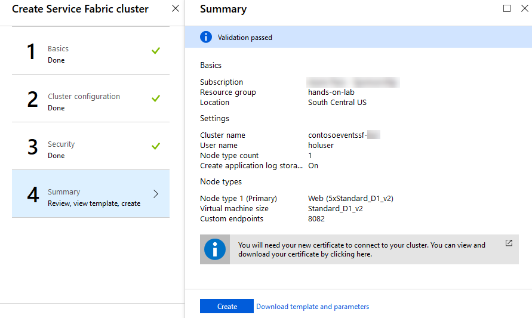

7.  It can take up to 30 minutes or more to provision your Service Fabric Cluster. You can move on to the next task while you wait.

>**Note**: If you experience errors related to lack of available cores, you may have to delete some other compute resources, or request additional cores to be added to your subscription, and then try this again.

### Task 2: Provision a lab virtual machine (VM)

In this task, you will provision a virtual machine (VM) in Azure. The VM image used will have Visual Studio Community 2019 installed.

1.  Launch a web browser and navigate to the [Azure portal](https://portal.azure.com/).

2.  Select +Create a Resource, then type "Visual Studio 2019" into the search bar. Select **Visual Studio 2019 Latest** from the dropdown list.

    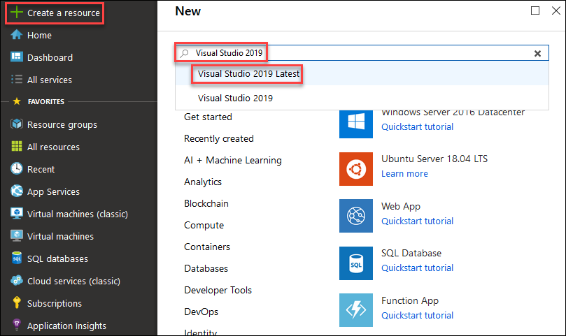

3.  On the Visual Studio 2019 Latest blade, select **Visual Studio 2019 Community (latest release) on Windows 10 Enterprise N (x64)** as the software plan and select Create.

    

4.  Set the following configuration on the Basics tab:

    -   Subscription: Select the subscription you are using for this lab.
    
    -   Resource group: Select Use existing, and select the **hands-on-lab** resource group created previously.
    
    -   Virtual machine name: Enter **LabVM**
    
    -   Region: Select the region you are using for resources in this lab.
    
    -   Availability options: Leave No infrastructure redundancy required selected.
    
    -   Image: Leave **Visual Studio 2019 Community (latest release) on Windows 10 Enterprise N (x64)** selected.
    
    -   Username: Enter **holuser**

    -   Password: Enter **Password.1!!**

5.  Select Change size.

6.  On the Select a VM Size blade, enter d4 into the search text field. Then, click the Select button to return to the Create a virtual machine blade.

    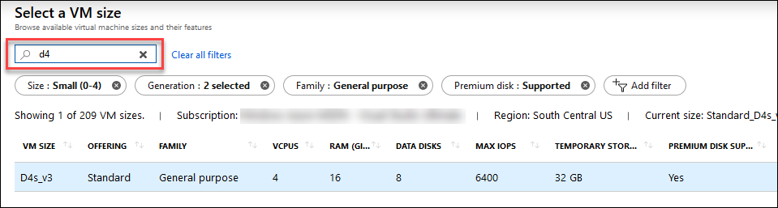
    
7.  Within the **INBOUND PORT RULES** section, select the Allow selected ports option, then choose RDP (3389) from the Select  inbound ports dropdown list.

8.  Accept all the remaining default values on the Basic blade and select Review + create.

    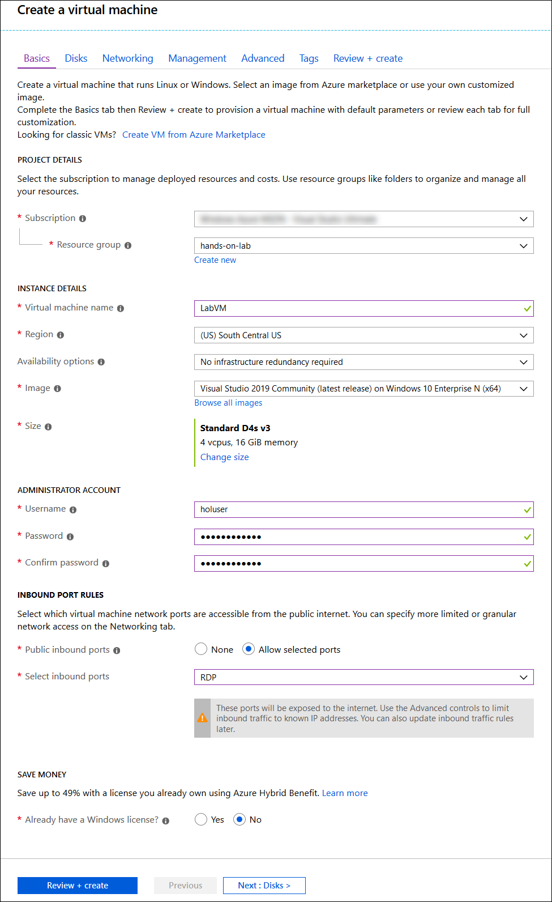

9.  Select Create on the Create a virtual machine blade to provision the virtual machine.
    
    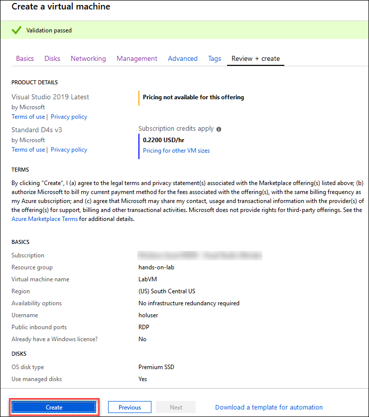

>**Note**: It may take 10+ minutes for the virtual machine to complete provisioning.

### Task 3: Connect to your lab VM

In this step, you will open an RDP connection to your Lab VM and disable Internet Explorer Enhanced Security Configuration.

1.  Connect to the Lab VM (If you are already connected to your Lab VM, skip to Step 9).

2.  From the side menu in the Azure portal, select Virtual machines.

    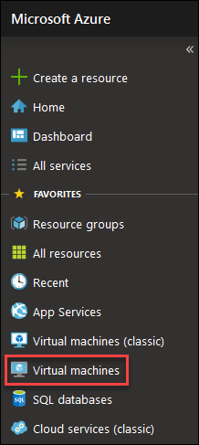

3.  In the Virtual machines blade, select LabVM from the list.

    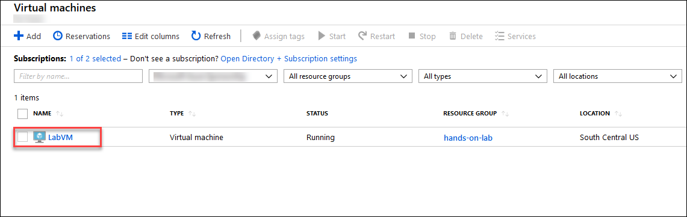

4.  In the LabVM blade, select Connect from the top menu.

    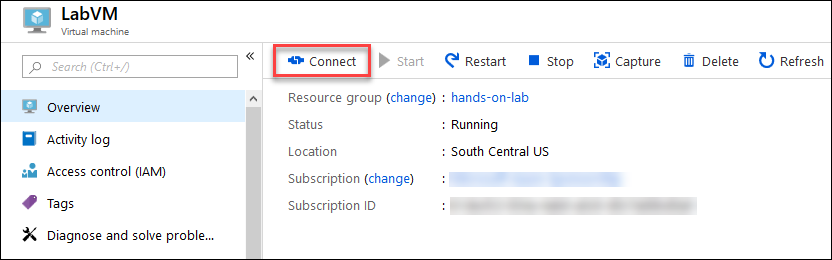

5.  Download and open the RDP file.

6.  Select Connect on the Remote Desktop Connection dialog.

    

7.  Enter the following credentials (or the non-default credentials if you changed them):

    a.  Username: Enter **holuser**

    b.  Password: Enter **Password.1!!**

    

8.  Select Yes to connect, if prompted that the identity of the remote computer cannot be verified.

    

### Task 4: Install Chrome on LabVM

In this task, you will install the Google Chrome browser on your Lab VM.

1.  On your Lab VM, open a web browser, and navigate to <https://www.google.com/chrome/browser/desktop/index.html>, and select Download Chrome.

    

2.  Select Accept and Install on the terms of service screen.

    

3.  Select Run on the Application Run -- Security Warning dialog.

    

4.  Select Run again, on the Open File -- Security Warning dialog.

    

5.  Once the Chrome installation completes, a Chrome browser window should open. For ease, you can use the instructions in that window to make Chrome your default browser.

### Task 5: Install Docker for Windows

In this task, you will install Docker for Windows on your Lab VM.

1.  On your Lab VM, open a browser and navigate to: <https://download.docker.com/win/stable/Docker%20for%20Windows%20Installer.exe>.

2.  If prompted, select Save File to download the installer on the Lab VM.

    

3.  When finished, open the folder where the file was downloaded.

4.  Double-click the Docker for Windows Installer.exe file in order to run the installer.
    
    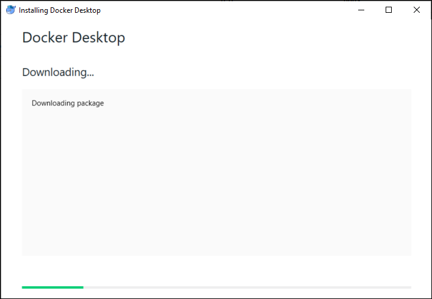

5.  Follow the instructions to install the application.

6.  Once the Docker for Windows installation completes, select the Close and log out button.  This action will log out the current session.

7.  Reconnect to the LabVM virtual machine by repeating the step 5 in Task 3.

8.  When prompted, select Ok on the Docker Desktop dialog box that asks you if you want to enable Hyper-V and Containers features.  This action will restart the virtual machine.

    
    
9. Reconnect to the LabVM virtual machine by repeating the step 5 in Task 3.

10. Wait for Docker for Windows to start.  You can see its status on the icon in the tray bar.  When Docker starts successfully, it will display the Welcome window.

    

### Task 6: Install Service Fabric SDK for Visual Studio

In this task, you will install the latest Service Fabric SDK for Visual Studio on your Lab VM.

1.  On your Lab VM, open a browser, and navigate to: <https://docs.microsoft.com/azure/service-fabric/service-fabric-get-started>.

2.  Scroll down on the page to the Install the SDK and tools section and select **Install the Microsoft Azure Service Fabric SDK** under the To use Visual Studio 2017 heading.  Regardless of the heading, it can be installed on Visual Studio 2019.

    

3.  Run the downloaded executable and select Install in the Web Platform Installer screen.
   
    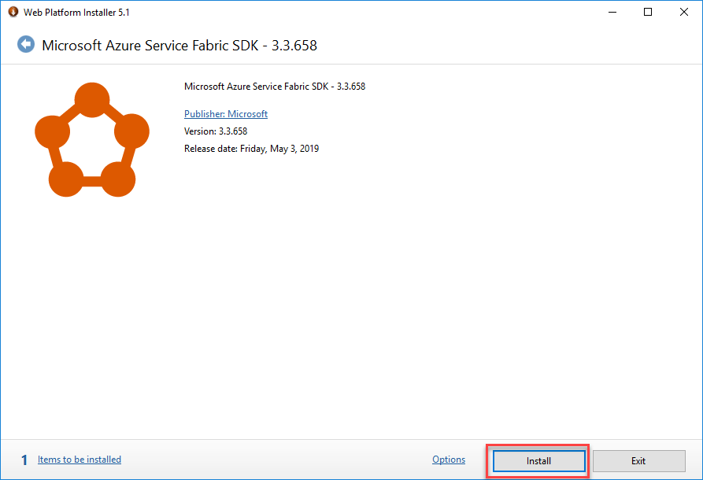

4.  On the Prerequisites screen, select I Accept.

    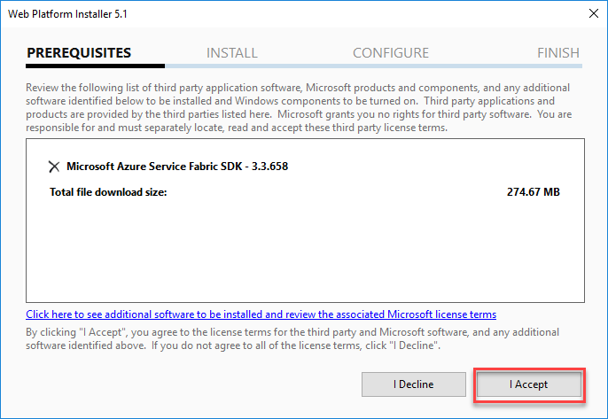

5.  Select Finish when the install completes.

    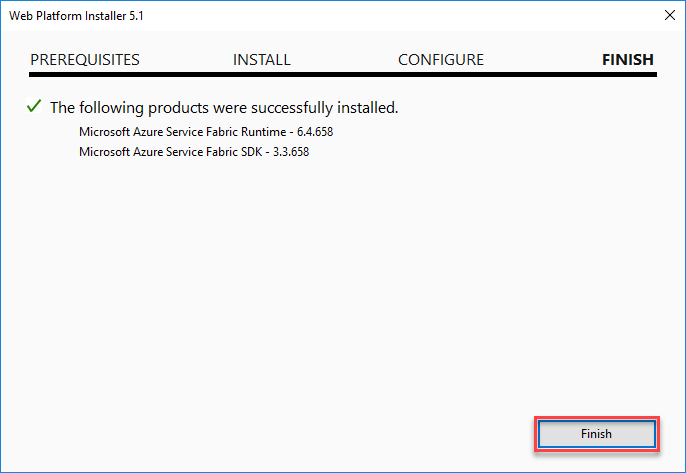

6.  Select Exit on the Web Platform installer to close it.

7.  Restart the VM to complete the installation and start the local Service Fabric cluster service.

### Task 7: Setup Service Fabric certificate

When you create a new Service Fabric Cluster using the portal, a secure cluster is deployed. In order to later on be able to make use of it, a certificate setup is required.

In this task, you will download the required certificate and install it on your Lab VM.

1.  In the Azure portal, navigate to the Resource Group you created previously and where you created the Key vault that supports the cluster.

2.  Select the key vault from the list of resources in the resource group.

    

3.  Under the Settings category in the menu, select Certificates and then select the existing certificate.

    

4.  Select the Current Version of the existing certificate.

    

5.  In the certificate information blade, select Download in PFX/PEM format and save the certificate.

    

6.  Copy the downloaded certificate into the Lab VM.

7.  On the Lab VM, double-click the copied certificate to initiate its installation. Select Local Machine as the Store Location and select Next.

    

8.  Select Next.

    

9.  Select Next.

    

10. Select Next.

    

11. Select Finish.

    

12. When the import finishes successfully, select OK.

    

13. On the Lab VM, double-click the copied certificate once again to initiate its installation. Select Current User as the Store Location and select Next.

    

14. Select Next.

    

15. Select Next.

    

16. Select Next.

    

17. Select Finish.

    

18. When the import finishes successfully, select OK.

    

### Task 8: Validate Service Fabric ports

Occasionally, when you create a new Service Fabric Cluster using the portal, the ports that you requested are not created. This will become evident when you try to deploy and run the Web App, because the required ports will not be accessible through the cluster.

In this task, you will validate that the ports are open and if not, fix the issue.

1.  In the Azure portal, navigate to the Resource Group you created previously, and where you created the cluster. If your Service Fabric cluster is still deploying, do not proceed to the next step until the deployment is completed.

2.  Select the load balancer from the list of resources in the resource group.

    

3.  Under the Settings category in the menu, select Health probes.

    

4.  Verify if a probe exists for ports 8082 and 8083, and that it is "Used By" a load balancing rule. If both of these are true, you can skip the remainder of this task. Otherwise, proceed to the next step to create the probe and load-balancing rule.

    

5.  Select +Add on the Health probes blade.

    

6.  On the Add health probe blade, enter the following:

    -   Name: Enter **WebApiPortProbe**.

    -   Protocol: Select TCP.

    -   Port: Enter **8082**.

    -   Interval: Leave the default value.

    -   Unhealthy threshold: Leave the default value.

    -   Select OK to create the probe.

        

7.  Once the Health probe is added (this can take a few minutes to update), you will create a rule associated with this probe. Under the Settings block in the menu, select Load balancing rules.

    

8.  Select +Add on the Load balancing rules blade.

    

9.  On the Add Load balancing rules blade, enter the following:

    -   Name: Enter **LBWebApiPortRule**.

    -   IP Version: Leave IPv4 selected.

    -   Frontend IP address: Leave the default value selected.

    -   Protocol: Leave as TCP.

    -   Port: Set to **8082**.

    -   Backend port: Set to **8082**.

    -   Backend pool: Leave the default value selected.

    -   Health probe: Select the WebApiPortProbe you created previously.

    -   Leave the default values for the remaining fields, and Select OK.

    

10. If you get an error notification such as "Failure to create probe", ignore this, but just go check that the probe indeed exists. It should. You now have a cluster ready to deploy to and expose 8082 as the Web API endpoint / port.

11. If necessary, repeat the same steps to create the probe for port 8083.

You should follow all steps provided *before* performing the Hands-on lab.
