<div class="MCWHeader1">
Microservices architecture - Developer edition
</div>

<div class="MCWHeader2">
Hands-on lab step-by-step
</div>

<div class="MCWHeader3">
June 2019
</div>
    
Information in this document, including URL and other Internet Web site references, is subject to change without notice. Unless otherwise noted, the example companies, organizations, products, domain names, e-mail addresses, logos, people, places, and events depicted herein are fictitious, and no association with any real company, organization, product, domain name, e-mail address, logo, person, place or event is intended or should be inferred. Complying with all applicable copyright laws is the responsibility of the user. Without limiting the rights under copyright, no part of this document may be reproduced, stored in or introduced into a retrieval system, or transmitted in any form or by any means (electronic, mechanical, photocopying, recording, or otherwise), or for any purpose, without the express written permission of Microsoft Corporation.

Microsoft may have patents, patent applications, trademarks, copyrights, or other intellectual property rights covering subject matter in this document. Except as expressly provided in any written license agreement from Microsoft, the furnishing of this document does not give you any license to these patents, trademarks, copyrights, or other intellectual property.

The names of manufacturers, products, or URLs are provided for informational purposes only and Microsoft makes no representations and warranties, either expressed, implied, or statutory, regarding these manufacturers or the use of the products with any Microsoft technologies. The inclusion of a manufacturer or product does not imply endorsement of Microsoft of the manufacturer or product. Links may be provided to third party sites. Such sites are not under the control of Microsoft and Microsoft is not responsible for the contents of any linked site or any link contained in a linked site, or any changes or updates to such sites. Microsoft is not responsible for webcasting or any other form of transmission received from any linked site. Microsoft is providing these links to you only as a convenience, and the inclusion of any link does not imply endorsement of Microsoft of the site or the products contained therein.

© 2016 Microsoft Corporation. All rights reserved.

Microsoft and the trademarks listed at <https://www.microsoft.com/en-us/legal/intellectualproperty/Trademarks/Usage/General.aspx> are trademarks of the Microsoft group of companies. All other trademarks are property of their respective owners.

**Contents**

<!-- TOC -->

- [Microservices architecture -- Developer edition hands-on lab step-by-step](#microservices-architecture----developer-edition-hands-on-lab-step-by-step)
    - [Abstract and learning objectives](#abstract-and-learning-objectives)
    - [Overview](#overview)
    - [Solution architecture](#solution-architecture)
    - [Requirements](#requirements)
    - [Exercise 1: Environment setup](#exercise-1-environment-setup)
        - [Task 1: Download and open the ContosoEventsPoC starter solution](#task-1-download-and-open-the-contosoeventspoc-starter-solution)
        - [Task 2: API Management](#task-2-api-management)
        - [Task 3: Web App](#task-3-web-app)
        - [Task 4: Function App](#task-4-function-app)
        - [Task 5: Storage account](#task-5-storage-account)
        - [Task 6: Cosmos DB](#task-6-cosmos-db)
        - [Task 7: Container Registry](#task-7-container-registry)
    
    - [Exercise 4: Publish the Service Fabric Application](#exercise-4-publish-the-service-fabric-application)
        - [Task 1: Publish the application](#task-1-publish-the-application)
        - [Task 2: Test an order from the cluster](#task-2-test-an-order-from-the-cluster)
    - [Exercise 5: API Management](#exercise-5-api-management)
        - [Task 1: Import API](#task-1-import-api)
        - [Task 2: Retrieve the user subscription key](#task-2-retrieve-the-user-subscription-key)
        - [Task 3: Configure the Function App with the API Management key](#task-3-configure-the-function-app-with-the-api-management-key)
    - [Exercise 6: Configure and publish the web application](#exercise-6-configure-and-publish-the-web-application)
        - [Task 1: Configure the web app settings](#task-1-configure-the-web-app-settings)
        - [Task 2: Running the web app and creating an order](#task-2-running-the-web-app-and-creating-an-order)
        - [Task 3: Publish the web app](#task-3-publish-the-web-app)
    - [After the hands-on lab](#after-the-hands-on-lab)
        - [Task 1: Delete the resource group](#task-1-delete-the-resource-group)

<!-- /TOC -->

# Microservices architecture -- Developer edition hands-on lab step-by-step

## Abstract and learning objectives

In this hands-on lab, you will construct an end-to-end Proof of concept for ticket ordering based on a microservices architecture based on Service Fabric and Azure Functions, alongside other supporting Azure features such as API Management, Web Apps, Azure Active Directory and Cosmos DB.

At the end of this hands-on lab, you will better be able to build solutions that leverage these Azure features, in addition to gaining experience with deploying, scaling, upgrading and rolling back Service Fabric applications.

## Overview

Contoso Events is an online service for concerts, sporting and other event ticket sales. They are redesigning their solution for scale with a microservices strategy and want to implement a POC for the path that receives the most traffic: ticket ordering.

In this hands-on lab, you will construct an end-to-end POC for ticket ordering. You will leverage Service Fabric, API Management, Function Apps, Web Apps, and Cosmos DB.

![The Event Ticket sales flowchart begins with Azure AD B2C, which points to Contoso Events Site Web App. A bi-directional arrow points between the Web App and API Manager, which in turn has a bi-direction arrow pointing between it and Web API (Stateless Service). An arrow points from there to Ticket Order Service (Stateful Service), which points to Ticket Order Actor (Processor). The Web API, Ticket Order Service, and Ticket Order Actor are all part of the Contoso Events Service Fabric App. from Ticket Order Actor, an arrow points to Order Externalization (Queue), then on to Process Order Externalization (Azure Function), and ends at Cosmos DB (Orders Collection). ](media/image2.png "Event Ticket sales flowchart")

## Solution architecture

The following figures are intended to help you keep track of all the technologies and endpoints you are working with in this hands-on lab. The first figure is the overall architecture, indicating the Azure resources to be employed. The second figure is a more detailed picture of the key items you will want to remember about those resources as you move through the exercises.

<!--TODO: CHANGE-->


<!--TODO: CHANGE-->
 

## Requirements

1.  Microsoft Azure subscription must be pay-as-you-go or MSDN

    -   Trial subscriptions will not work.

2.  A virtual machine configured with (see Before the hands-on lab):

    -   Visual Studio 2019 Community edition, or later

    -   Azure Development workload enabled in Visual Studio 2019 (enabled by default on the VM)

    -   Service Fabric SDK 3.3 or later for Visual Studio

    -   Google Chrome browser (Swagger commands do not work in IE)
    
    -   Docker for Windows
    
    -   PowerShell 3.0 or higher (v5.1 already installed on VM)

## Exercise 1: Environment setup

Duration: 30 minutes

Contoso Events has provided a starter solution for you. They have asked you to use this as the starting point for creating the Ticket Order POC solution with Service Fabric.

Because this is a "born in Azure" solution, it depends on many Azure resources. You will be guided through creating those resources before you work with the solution in earnest. The following figure illustrates the resource groups and resources you will create in this exercise.

<!--TODO: CHANGE-->


### Task 1: Download and open the ContosoEventsPoC starter solution

1.  On your Lab VM, open a browser to https://github.com/Microsoft/MCW-Microservices-architecture. Click the **Clone or download** link and then select **Download ZIP**
    
2.  Unzip the contents to the folder **C:\\**.

3.  Locate the solution file (C:\\MCW-Microservices-architecture-master\\Source\\ContosoEventsPoC-DeveloperEdition\\Src\\ContosoEventsPOC.sln), and double-click it to open it with Visual Studio 2019.

4.  If prompted about how you want to open the file, select **Visual Studio 2019**, and select **OK**.

    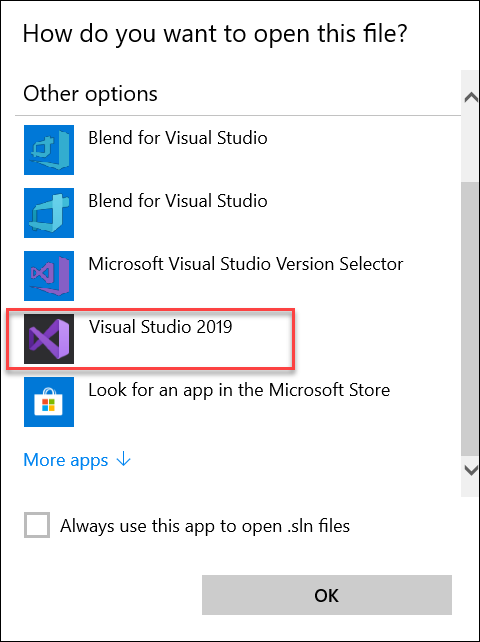

5.  Log into Visual Studio or set up an account, when prompted.

    

6.  If presented with a security warning, uncheck **Ask me for every project in this solution**, and select **OK**.

    

7.  If you are missing any prerequisites (listed under Requirements above), you may be prompted to install these at this point.

8.  Verify your Visual Studio version is 16.1.0 or higher.

    a.  Click **Help** in the menu, then select **About Microsoft Visual Studio**.

    b.  If the version is not 16.1.0, you will need to update it.  Click **OK**, then click **View** in the menu.  Select **Notifications**, you should see an entry for **Visual Studio Update is available***.  Select it and then click **Update** to update your instance.

9.  Before you attempt to compile the solution, set the configuration to x64 by selecting it from the Solution Platforms drop down in the Visual Studio toolbar.

    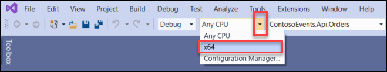

10.  Build the solution, by selecting **Build** from the Visual Studio menu, then selecting **Build Solution**.

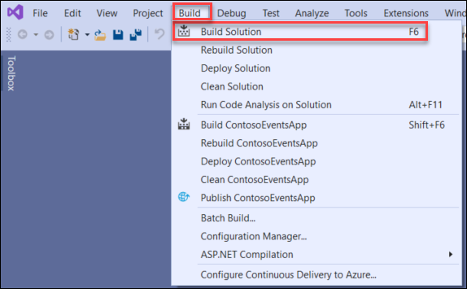


### Task 2: API Management

In this task, you will provision an API Management Service in the Azure portal.

1.  In the Azure portal, select **+Create a resource**, enter **API Management** into the Search the Marketplace box, then select API management from the results.


2.  In the API Management blade, select **Create**.

3.  In the API Management service blade, enter the following:

    a.  Name: Enter a unique name, such as **contosoevents-SUFFIX**.

    b.  Subscription: Choose your subscription.

    c.  Resource group: Select Use existing, and select the **hands-on-lab** resource group you created previously.

    d.  Location: Select the same region used for the hands-on-lab resource group.

    e.  Organization name: Enter **Contoso Events**.

    f.  Administrator email: Enter your email address.

    g.  Pricing tier: Select **Developer (No SLA)**.
    
    h.  Enable Application Insights: Leave unchecked.

    i.  Select **Create**.

    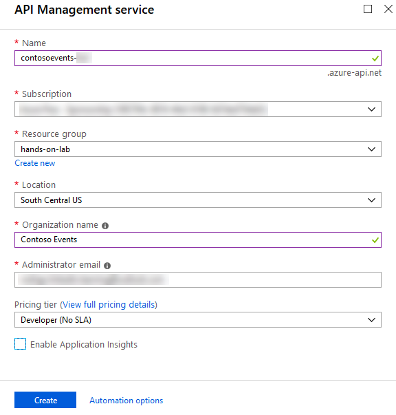

4.  After the API Management service is provisioned, the service will be listed in the Resource Group. This may take 10-15 minutes, so move to Task 3 and return later to verify.

### Task 3: Web App

In these steps, you will provision a Web App in a new App Service Plan.

1.  Select **+Create a resource** in the Azure Portal, select **Web**, then select **Web App**.

    

2.  On the Create Web App blade, enter the following:

    a.  App name: Enter a unique name, such as **contosoeventsweb-SUFFIX**.

    b.  Subscription: Select your subscription.

    c.  Resource group: Select Use existing, and select the **hands-on-lab** resource group created previously.

    d.  OS: Select **Windows**.

    e.  App Service plan/Location: Click to open the App Service plan blade, then select **Create new**.

       - App service plan: Enter **contosoeventsplan-SUFFIX**

       - Location: Select the same location you have been using for other resources in this lab.

       - Pricing tier: Select **S1 Standard**.

       - Select **OK**.
    
    f.  Publish: Select **Code**
    
    g.  Application Insights: Click to open the Application Insights blade, then select **Disable**.  Select **Apply**.
    
    h.  Select **Create** to provision the Web App.

    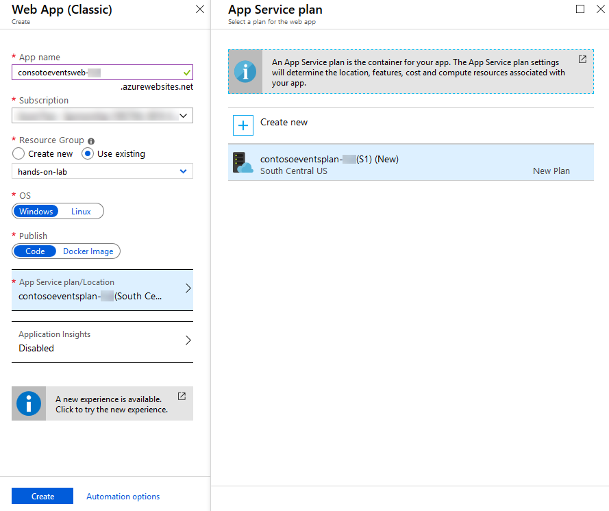
    

3.  You will receive a notification in the Azure portal when the Web App deployment completes. From this, select Go to resource.

    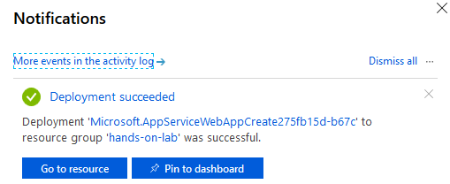

4.  On the Web App Overview blade, you can see the URL used to access your Web App. If you select this, it will open an empty site, indicating your App Service app is up and running.

    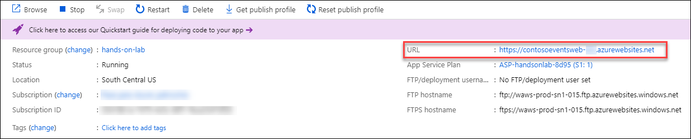

### Task 4: Function App

In this task, you will provision a Function App using a Consumption Plan. By using a Consumption Plan, you enable dynamic scaling of your Functions.

1.  Select **+Create a resource** in the Azure Portal, and enter "Function App" in the Search the Marketplace box, then select **Function App** from the results.

   

2.  Select **Create** on the Function App blade.

3.  On the Create Function App blade, enter the following:

    a.  App name: Enter a unique name, such as **contosoeventsfn-SUFFIX**.

    b.  Subscription: Select your subscription.

    c.  Resource group: Select Use existing, and select the **hands-on-lab** resource group created previously.

    d.  OS: Select **Windows**.

    e.  Hosting Plan: Select **Consumption Plan**.

    f.  Location: Select the same location as the hands-on-lab resource group.

    g.  Runtime Stack: **.NET**

    h.  Storage: Leave Create new selected, and accept the default name.

    i.  Application Insights: Click to open the Application Insights blade.  Select **Disable** and then select **Apply**.

    j.  Select **Create** to provision the new Function App.

    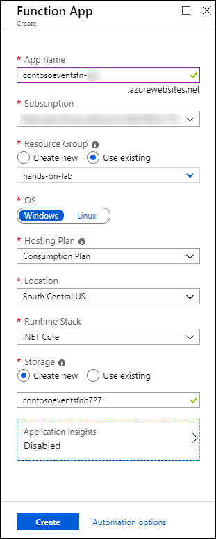
    

### Task 5: Storage account

In this section, you will create a Storage account for the application to create and use queues required by the solution.

1.  In the Azure portal, select **+Create a resource** to open the New blade.  Select the Storage option from the menu, then select **Storage account** under Featured.

    

    
2.  In the Create Storage account blade Basics Tab, enter the following:

    a.  Subscription: Select your subscription.

    b.  Resource group: Select the existing **hands-on-lab** resource group previously created.

    c.  Name: Enter a unique name, such as **contosoeventsSUFFIX**.  Please note that the field can contain only lowercase letters and numbers.

    d.  Location: Select the same location as the hands-on-lab resource group.

    e.  Performance: Select **Standard**.

    f.  Account kind: Select **Storage (general purpose v1)**.

    g.  Replication: Select **Locally-redundant storage (LRS)**.

    h.  Select **Next : Advanced >**.

    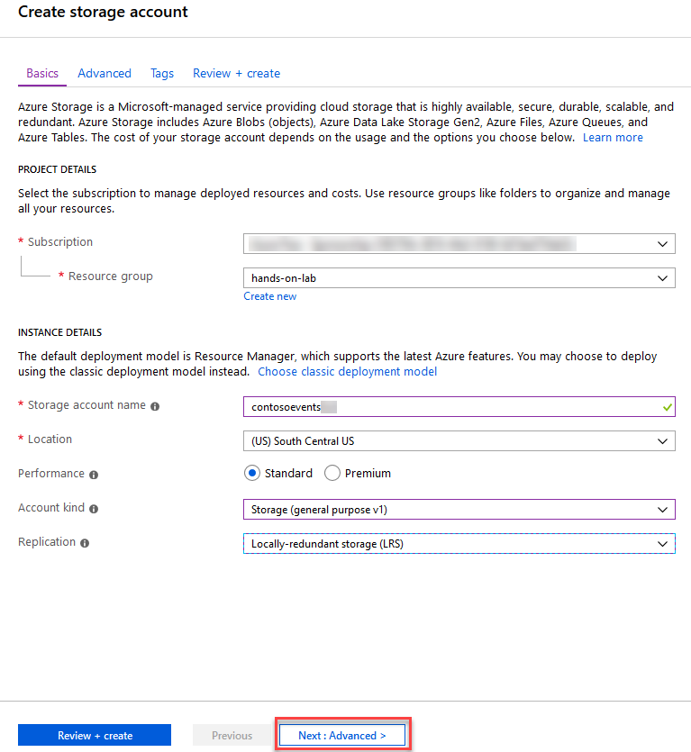

3.  Within the Advanced Tab: 

    a. Set Secure transfer required to **Disabled**, and then select **Review + create** tab. 

    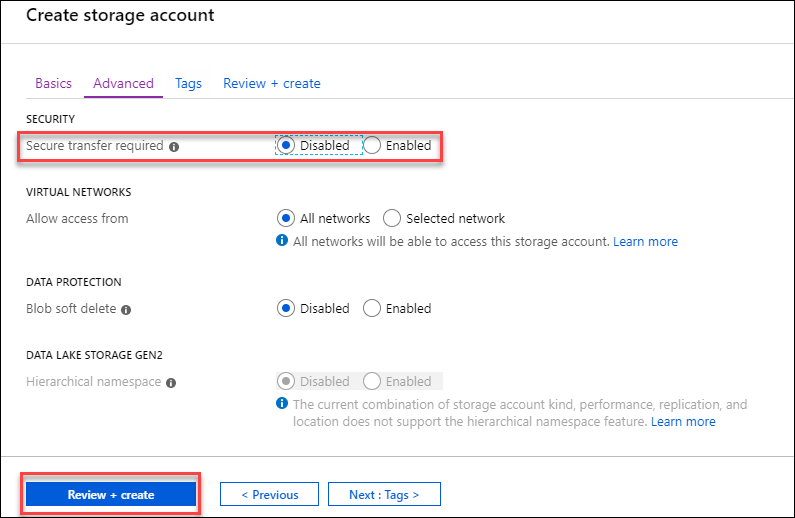

    b.  Select **Create** in the Review + create tab.

    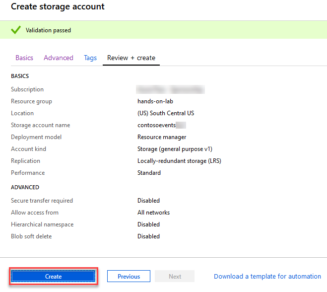

### Task 6: Cosmos DB

In this section, you will provision a Cosmos DB account, a Cosmos DB Database and a Cosmos DB collection that will be used to collect ticket orders.

1.  In the Azure portal, select **+Create a resource** to open the New blade.  Select the Databases option from the menu, then select **Azure Cosmos DB**.

    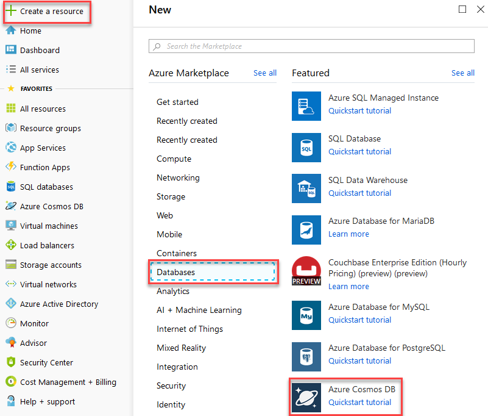


2.  On the Create Azure Cosmos DB Account blade, enter the following:

    a.  Subscription: Select your subscription.

    b.  Resource group: Select the **hands-on-lab** resource group previously created.

    c.  Account Name: Enter a unique value, such as **contosoeventsdb-SUFFIX**.

    d.  API: Select **Core (SQL)**.

    e.  Location: Select the location used for the hands-on-lab resource group. If this location is not available, select one close to that location that is available.
    
    f.  Geo-Redundancy: Select **Disable**.
    
    g.  Multi-region Writes: Select **Disable**.

    h.  Select **Review + create**.

    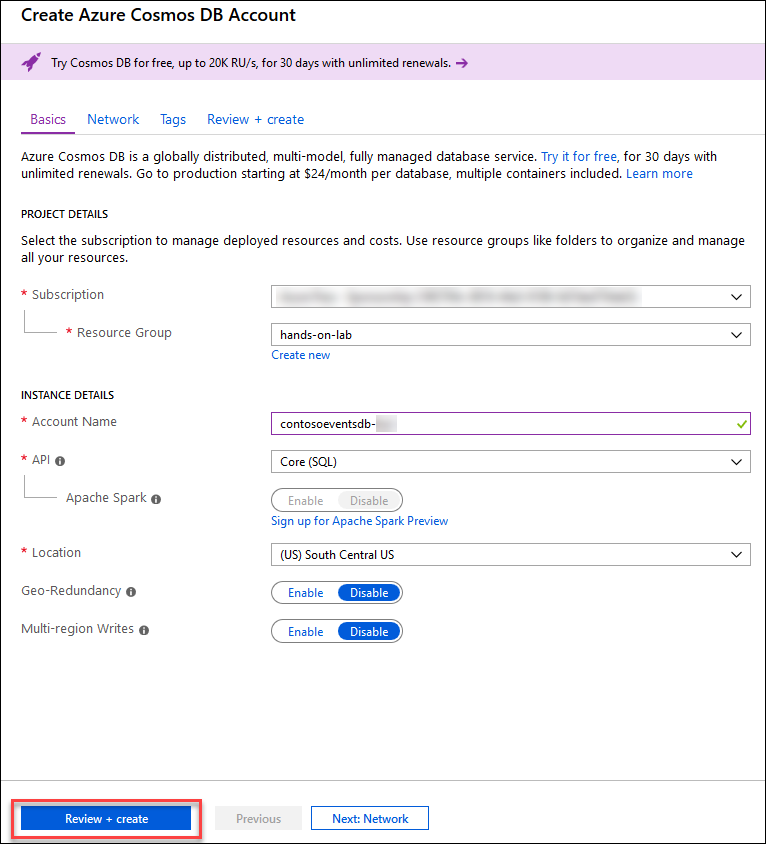
    
    i. Select **Create** to provision the Cosmos DB after the validation has passed.
 
3.  When the Cosmos DB account is ready, select **Azure Cosmos DB** from the portal menu, and select your Cosmos DB account from the list.

    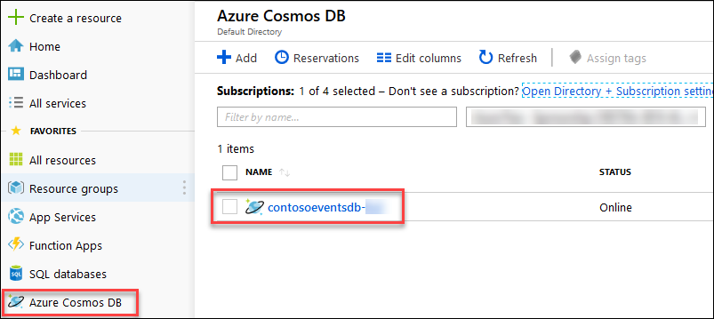

4.  On the Cosmos DB account blade, under Containers in the side menu, select **Browse**.

    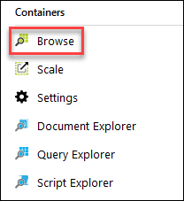

5.  On the Browse blade, select **+Add Container**.

    

6.  On the Add Container dialog, enter the following:

    a.  Database id: Select **Create new** and enter **TicketManager**.

    b.  Provision database throughput: Leave unchecked.

    c.  Container id: Enter **Orders**.
    
    d.  Partition key: **/EventId**
    
    e.  My partition key is larger than 100 bytes: Leave unchecked.

    f.  Throughput: Enter **2500**.

    g.  Select **OK** to create the new container.

    

7.  Select **New Container** from the screen that appears.

    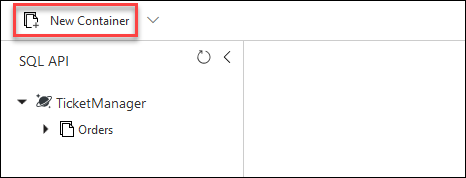

8.  In the Add Container dialog, enter the following:

    a.  Database id: Select **Use existing** and then select **TicketManager**.

    b.  Container id: Enter **Events**.

    c.  Partition key: **/id**

    d.  Throughput: Enter **2500**.

    e.  Select **OK** to create the new container.


    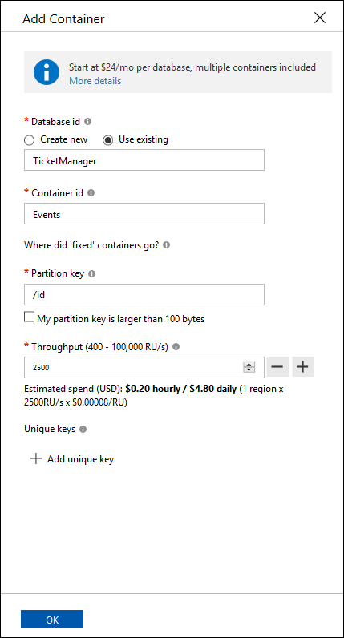

9.  You will be able to see that the two containers exist in the new database.

    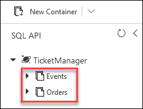
    
### Task 7: Container Registry
In this section, you will provision an Azure Container Registry resource, that will be used to store the microservices images.

1.  In the Azure portal, select +Create a resource to open the New blade.  Select the Containers option from the menu, then select **Container Registry**.

    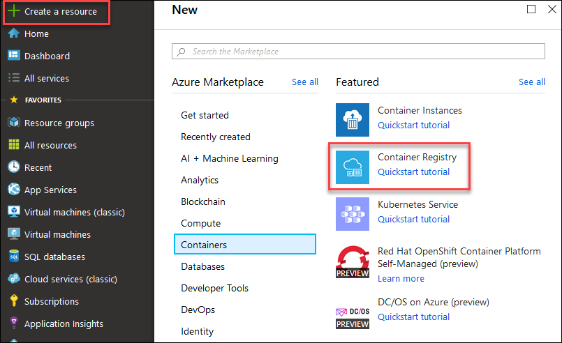

2.  In the Create container registry blade, set the following property values

    a.  Registry name: Enter a unique name, such as contosoeventsSUFFIX
    
    b.  Subscription: Select your subscription.
    
    c.  Resource group: Select the existing **hands-on-lab** resource group previously created
    
    d.  Location: Select the same location as the hands-on-lab resource group.
    
    e.  Admin user: Select **Enable**.
    
    f.  SKU:  Select **Standard**
    
    g.  Select Create
    
    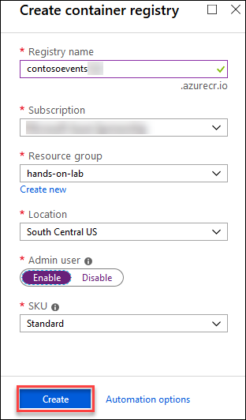
    
## Exercise 2: Microservices containerization
Duration: 30 minutes

In this exercise, you will create the Docker images for each of the microservices in the solution.

### Task 1: Inspect the Dockerfile files

1.  In Visual Studio, open the Dockerfile located in the ContosoEvents.Api.Events project.

2.  The Dockerfile contains all the required steps to build the Docker image for the Events microservice.  As you can see in the first line of code, it is based on the mcr.microsoft.com/dotnet/core/aspnet:2.2-stretch-slim Linux-based Docker image.  In the other hand, it uses the mcr.microsoft.com/dotnet/core/sdk:2.2-stretch image to compile and publish the Events microservice project.

3.  Open the Dockerfile located in the ContosoEvents.Api.Orders project.

4.  Likewise, this Dockerfile is based on the mcr.microsoft.com/dotnet/core/aspnet:2.2-stretch-slim Linux-based Docker image.  It also uses the mcr.microsoft.com/dotnet/core/sdk:2.2-stretch image to compile and publish the Orders microservice project.

### Task 2: Build the Docker images

1.  Open a Command Prompt by clicking the Start menu then typing cmd

2.  Change the directory to C:\MCW-Microservices-architecture-master\Source\ContosoEventsPoC-DeveloperEdition\Src

3.  In the Src folder as the root, type the following command in the Command Prompt: `docker build --tag [YOUR CONTAINER REGISTRY].azurecr.io/contosoevents-events:latest --file ContosoEvents.Api.Events\Dockerfile .`  Replace [YOUR CONTAINER REGISTRY] with the container registry name that you selected in Exercise 1, Task 7, Step 2.  Press Enter to execute the command and start the Docker container image creation process for the Events microservice.

    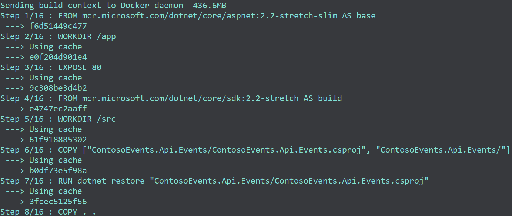

4.  Still in the Src folder as the root, type the following command in the Command Prompt: `docker build --tag [YOUR CONTAINER REGISTRY].azurecr.io/contosoevents-orders:latest --file ContosoEvents.Api.Orders\Dockerfile .`  Replace [YOUR CONTAINER REGISTRY] with the container registry name that you selected in Exercise 1, Task 7, Step 2.  Press Enter to execute the command and start the Docker container image creation process for the Orders microservice.

    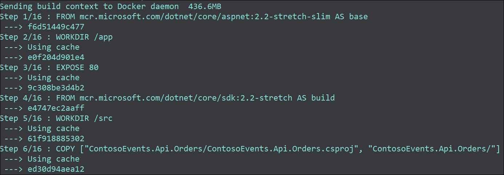
    
### Task 3: Inspect the Docker images

1.  In the Command Prompt, type the following command: `docker images` and press Enter to execute.

2.  The `images` parameter of the `docker` tool will show all the images stored in your local repository.  At this point, you should have both [YOUR CONTAINER REGISTRY].azurecr.io/contosoevents-events:latest and [YOUR CONTAINER REGISTRY].azurecr.io/contosoevents-orders:latest images at a minimum.

    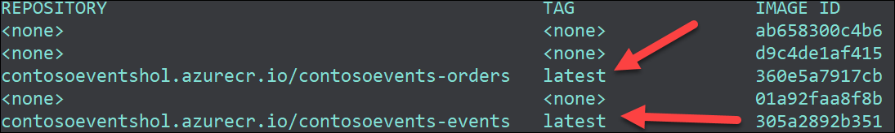

## Exercise 3: Push the container images to Azure Container Registry  

Duration: 15 minutes

### Task 1: Logon into the Container Registry

1.  In the Azure Portal, select the Resource groups option in the side menu, then select the **hands-on-lab** resource group from the list.

2.  In the hands-on-lab blade, select the contosoeventsSUFFIX container registry that you created on Exercise 1, Task 7.  For easy access, you can use the filter dropdown list and select only ' Container registries' option in the list.

    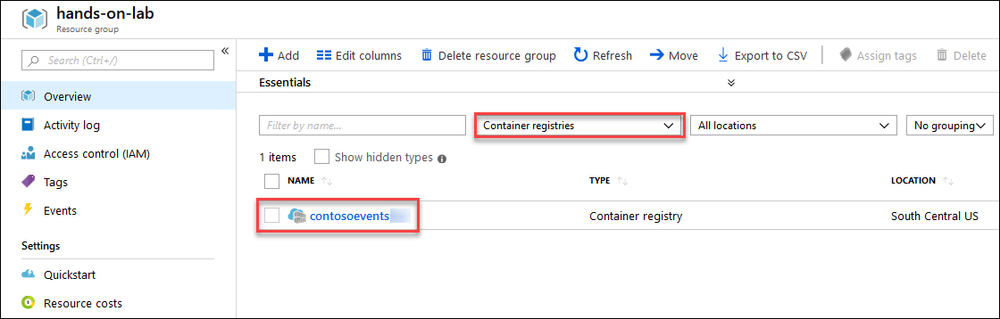
    
3.  In the Container registry blade, select the Access keys from the menu.

    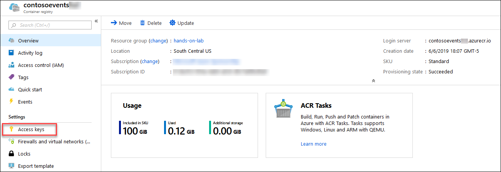
    
4.  In the Access keys blade, copy both the username and password in a Notepad.  You will use this credential values to login on the Azure Container Registry from Docker.

    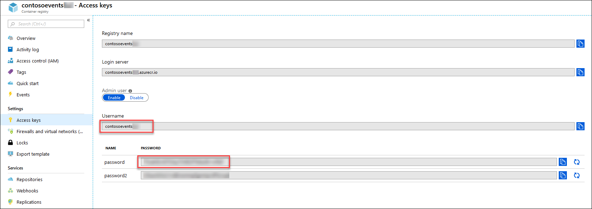
    
5.  Open a Command Prompt window

6.  Type the following command `docker login [YOUR CONTAINER REGISTRY].azurecr.io`.  Replace [YOUR CONTAINER REGISTRY] with the name that you selected in Exercise 1, Task 7.  Press Enter to execute the command.

7.  When prompted, paste the username and password to login.


### Task 2: Push the images to the Container Registry

1.  Type the following command `docker push [YOUR CONTAINER REGISTRY].azurecr.io/contosoevents-events:latest`.  Replace [YOUR CONTAINER REGISTRY] with the name that you selected in Exercise 1, Task 7.  Press Enter to execute the command.

    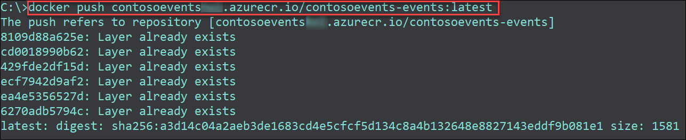

2.  Repeat this same process for the orders image, by typing the following command and then pressing Enter: `docker push [YOUR CONTAINER REGISTRY].azurecr.io/contosoevents-orders:latest` 

    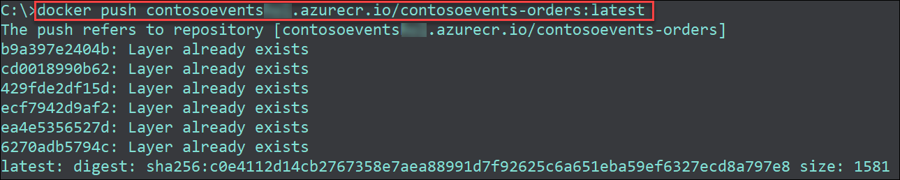
   
### Task 3: Inspect Container Registry in the Azure Portal

1.  In the Azure Portal, select the Resource groups option in the side menu, then select the **hands-on-lab** resource group from the list.

2.  In the hands-on-lab blade, select the contosoeventsSUFFIX container registry that you created on Exercise 1, Task 7.  For easy access, you can use the filter dropdown list and select only ' Container registries' option in the list.

3.  In the Container registry blade, select the Repositories option from the side menu to display the container images uploaded in the Azure Container Registry account.

    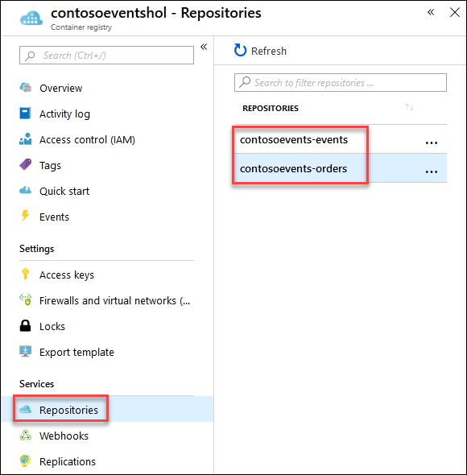


## Exercise 4: Publish the Service Fabric Application
Duration: 15 minutes

In this exercise, you will publish the Service Fabric Application to the Azure cluster you created previously.

### Task 1: Inspect the Cosmos DB account properties

1.  In Azure Portal, navigate to the hands-on-lab resource group by using the Resource groups menu item in the side menu.

2.  In the hands-on-lab blade, locate and select the Azure Cosmos DB account that you created previously with the name contosoeventsdb-SUFFIX.

3.  In the Cosmos DB account blade, select the Keys option from the menu.  In the Keys blade, copy the URI and PRIMARY KEY values in a Notepad.

    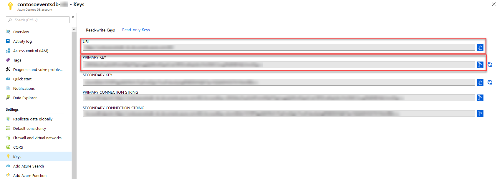
    
### Task 2: Inspect the Storage account properties

1.  In Azure Portal, navigate to the hands-on-lab resource group by using the Resource groups menu item in the side menu.

2.  In the hands-on-lab blade, locate and select the Storage account that you created previously with the name contosoeventsSUFFIX.

3.  In the Storage account blade, select the Access keys option from the menu.  Copy the Connection string value from the key1 section in a Notepad.

    

### Task 3: Set the environment variables to the Events microservice

1.  Open the ServiceManifest.xml file located in ContosoEvents\ApplicationPackageRoot\EventsPkg

2.  Locate the <ImageName> element (line 18) and replace [YOUR CONTAINER REGISTRY] with the name of your Container Registry account.  This element specifies the fully qualified name of the container image that is going to be used by the Service Fabric service.

3.  Locate the **accountEndpoint** and **accountKey** environment variables inside the \<EnvironmentVariables\> element.  Set their values to the URI and Key respectively, that you copied from the Cosmos DB account properties.

    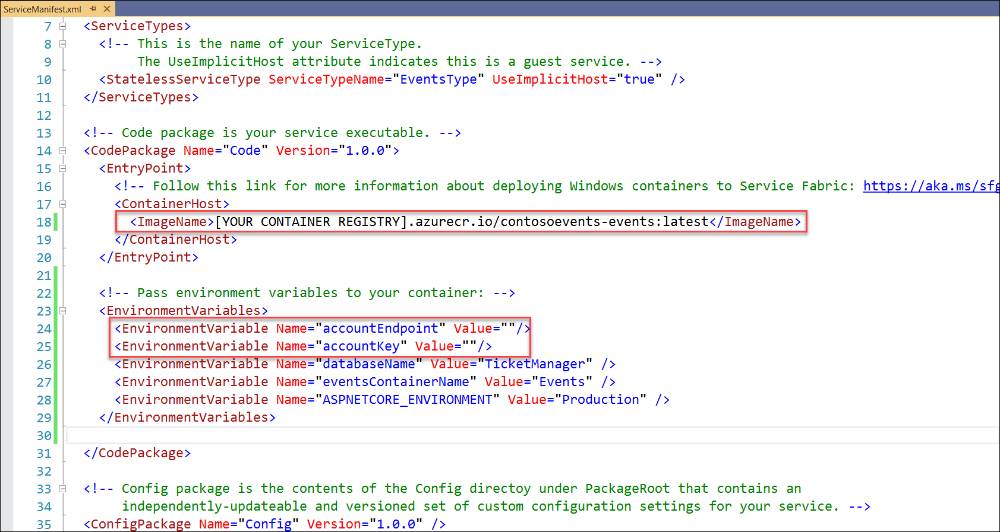

### Task 4: Set the environment variables to the Orders microservice

1.  Open the ServiceManifest.xml file located in ContosoEvents\ApplicationPackageRoot\OrdersPkg

2.  Locate the <ImageName> element (line 18) and replace [YOUR CONTAINER REGISTRY] with the name of your Container Registry account.  This element specifies the fully qualified name of the container image that is going to be used by the Service Fabric service.

3.  Locate the **accountEndpoint** and **accountKey** environment variables inside the \<EnvironmentVariables\> element.  Set their values to the URI and Key respectively, that you copied from the Cosmos DB account properties.
    
4.  Locate the **storageConnectionString** environment variable inside the \<EnvironmentVariables\> element.  Set its value to the Connection string that you copied previously from the Storage account properties.

    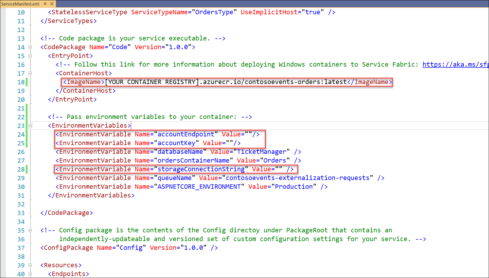
    
### Task 5: Set the Container Registry credentials in the ApplicationManifest.xml file

1.  Open the ApplicationManifest.xml file located in the ApplicationPackageRoot folder of the ContosoEvents project.

2.  Locate the **\<RepositoryCredentials\>** elements and replace the **AccountName** and **Password** attribute values with the username and password respectively that you copied previously from the Container Registry account properties.

    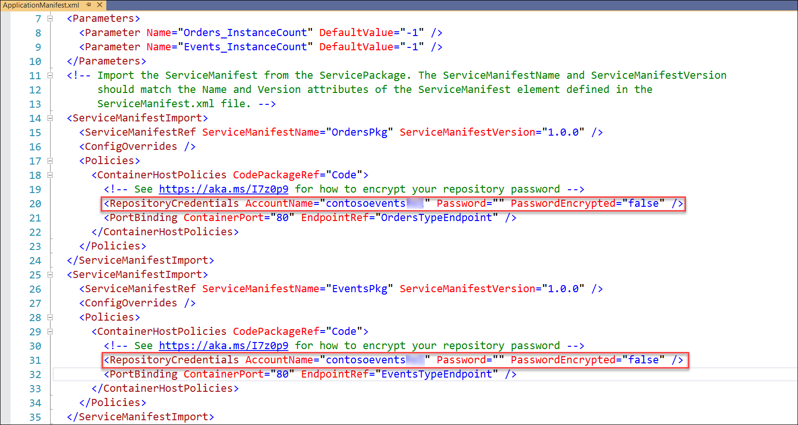

### Task 6: Publish the Service Fabric Application

1.  From Solution Explorer, right-click the ContosoEvents project and select **Publish...**.

2.  In the Publish Service Fabric Application dialog, set the Target profile to Cloud.xml, and select your Service Fabric Cluster endpoint from the Connection Endpoint drop down, then select **Publish**.

    

    >**Note**: Ensure that StoreLocation is CurrentUser and StoreName is My.

3.  Publishing to the hosted Service Fabric Cluster takes about 5 minutes. It follows the same steps as a local publish step with an alternate configuration. The Visual Studio output window keeps you updated of progress.

4.  From the Visual Studio output window, validate that the deployment has completed successfully before moving on to the next task.

### Task 7: Test the Events microservice by using Swagger

In this task, you will test the events retrieval from the application deployed in the hosted Service Fabric Cluster.

1.  In a Chrome browser on your Lab VM, navigate to the Swagger endpoint for the Events microservice exposed by the hosted Service Fabric cluster. The URL is made of:

    > For example:
    >
    > <http://contosoeventssf-SUFFIX.southcentralus.cloudapp.azure.com:8082/swagger>

2.  Expand the Events API and expand the GET method of the /api/Events endpoint.

3.  Select the Try it out button and then select the Execute button.

    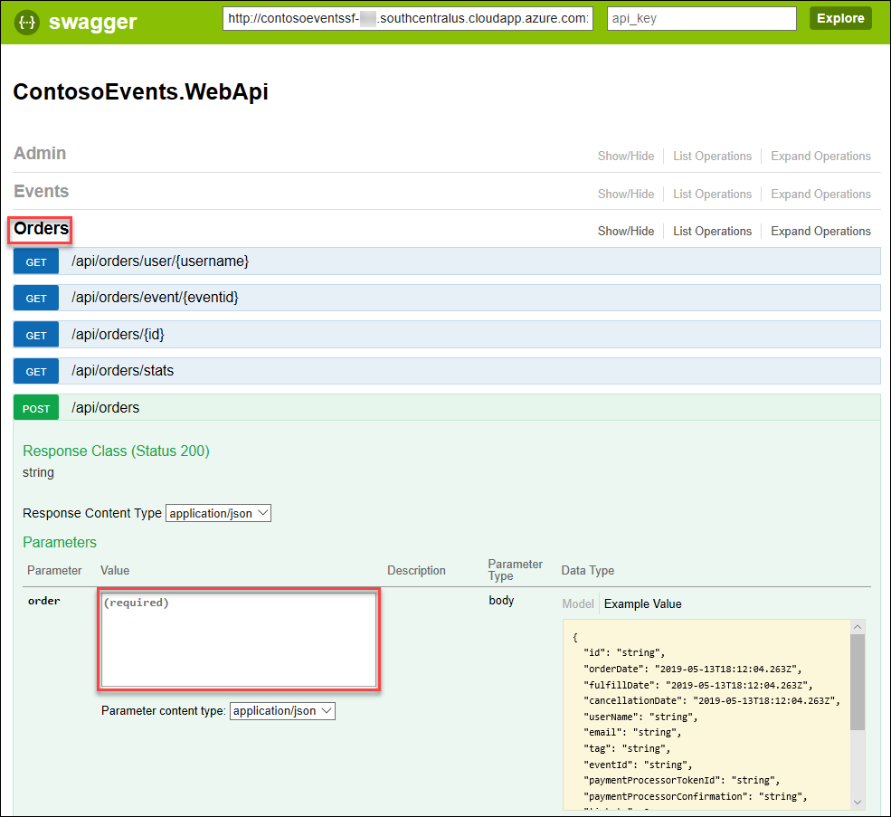

### Task 8: Test the Orders microservice by using Swagger

In this task, you will test the orders creation from the application deployed in the hosted Service Fabric Cluster.

1.  In a Chrome browser on your Lab VM, navigate to the Swagger endpoint for the Orders microservice exposed by the hosted Service Fabric cluster. The URL is made of:

    > For example:
    >
    > <http://contosoeventssf-SUFFIX.southcentralus.cloudapp.azure.com:8083/swagger>

2.  In the Orders API section, expand the POST method of the /api/Orders endpoint.

3.  Select the Try it out button.

4.  Copy the JSON below, and paste it into the order field, highlighted in the screen shot above, then select Execute.

    ```
        {
        "UserName": "johnsmith",
        "Email": "john.smith@gmail.com",
        "Tag": "Manual",
        "EventId": "EVENT1-ID-00001",
        "PaymentProcessorTokenId": "YYYTT6565661652612516125",
        "Tickets": 3
        }
    ```
    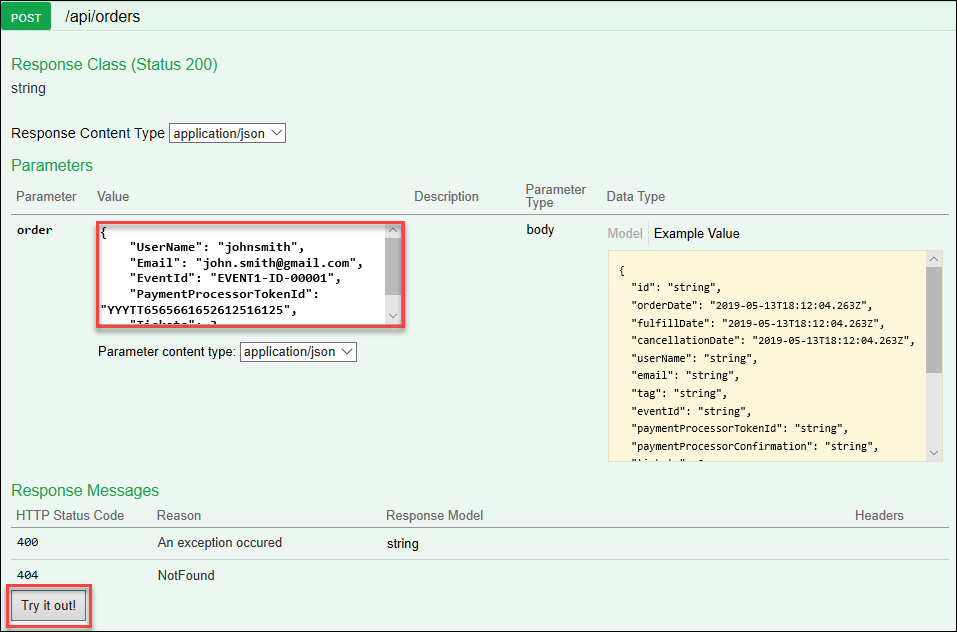

5.  This should return with HTTP 200 response code. The Response Body includes a unique order id that can be used to track the order. Copy the Response Body value. It will be used to verify the order was persisted in Cosmos DB.

6.  Verify that the order was persisted to the Orders collection.

7.  In the Azure portal, navigate to your Cosmos DB account.

8.  Perform a query against the Orders collection, as you did previously, to verify the order exists in the collection. Replace the id in the query with the order id you copied from the Response Body above.

    
    
    > Note: In order to write to the Cosmos DB database, the Azure Function must be running.


## Exercise 5: API Management

Duration: 15 minutes

In this exercise, you will configure the API Management service in the Azure portal.

### Task 1: Import API

In this task, you will import the Web API description to your API Management service to create an endpoint.

1.  In the Azure portal, navigate to the hands-on-lab resource group, and select your API Management Service from the list of resources.

    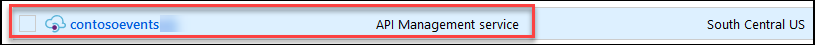

2.  In the API Management blade, select **APIs** under Api Management.

    

3.  In the APIs blade, select **OpenAPI**.

    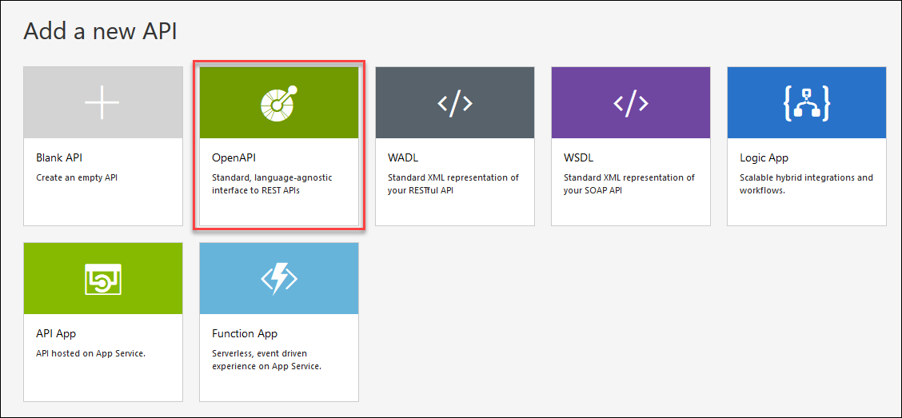

4.  Return to your Swagger browser window, and copy the URL from the textbox at the top of the screen, next to the Swagger logo, as shown in the screen shot below.

    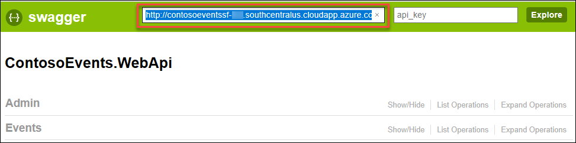

5.  Return to the Create from OpenAPI specification window, click the **Full** link and do the following:

    a. Paste the URL copied from Swagger into the OpenAPI specification textbox.

    b. Select **HTTPs** as the URL scheme.

    c. Enter **events** in the API URL suffix textbox.
    
    d. Tags: Leave empty.

    e. Select **Unlimited** in the Products.

    f. Select **Create**.

    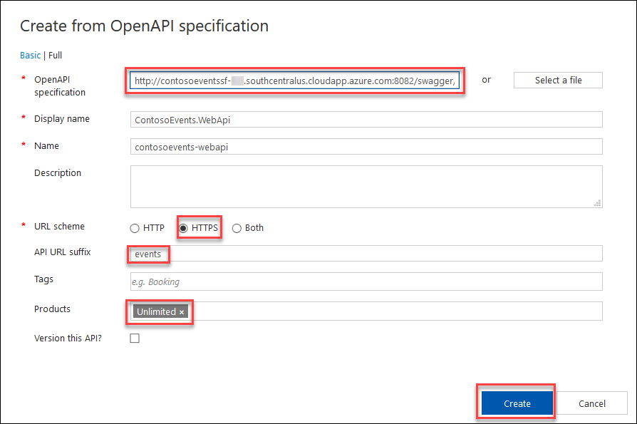

    > **Note**: You would typically create a new product for each environment in a scenario like this one. For example, Development, Testing, Acceptance and Production (DTAP) and issue a key for your internal application usage for each environment, managed accordingly.

6.  Select **Settings** in the ContosoEvents.WebApi toolbar, update **Web Service URL** to point to your published API endpoint.  Ensure that it uses HTTP instead of HTTPS, and select **Save**.

    

    > **Note**: Notice the URL under "Base URL". You will use this URL in your website configuration in the next exercise.

7.  Select **Design**. you will see your API backend endpoint.

    

### Task 2: Retrieve the user subscription key

In this task, you will retrieve the subscription key for the client applications to call the new API Management endpoint.

1.  In the Azure portal, navigate to your API Management service, and from the Overview blade, select **Developer portal** from the toolbar. This will open a new browser tab, and log you into the Developer portal as an administrator, giving you the rights you need to complete the following steps.

    

2.  In the Developer portal, expand the Administrator menu, and then select **Profile**.

    

3.  Select **Show** for the Primary Key of the Unlimited subscription to reveal it.

    

4.  Save this key for next steps.

    

5.  You now have the API Management application key you will need to configure the Function App settings.

### Task 3: Configure the Function App with the API Management key

In this task, you will provide the API Management key in a setting for the Function App, so it can reach the Web API through the API Management service.

1.  From the Azure Portal, browse to the Function App.

2.  You will create an Application setting for the function to provide it with the API Management consumer key.

3.  Select your Function App in the side menu, then select Application settings under Configured features.

    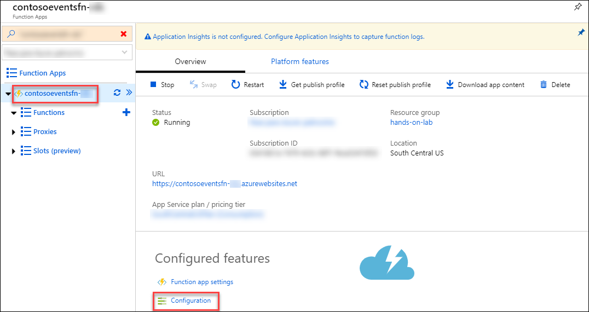

4.  In the Application settings section, select **+New application setting**, and enter **contosoeventsapimgrkey** into the name field, and paste the API key you copied from the Developer portal above into the value field.

    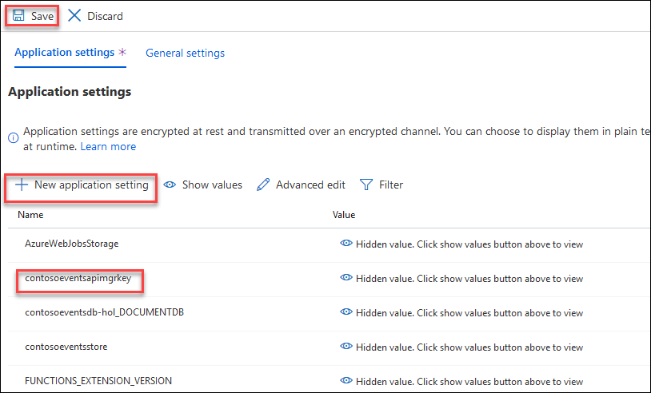

5.  Select **Save** to apply the change.


## Exercise 6: Configure and publish the web application

Duration: 15 minutes

In this exercise, you will configure the website to communicate with the API Management service, deploy the application, and create an order.

### Task 1: Configure the web app settings

In this task, you will update configuration settings to communicate with the API Management service. You will be guided through the instructions to find the information necessary to populate the configuration settings.

1.  Within Visual Studio Solution Explorer on your Lab VM, expand the Web folder, then expand the ContosoEvents.Web project, and open Web.config. You will update these appSettings in this file:

    ```
    <add key="apimng:BaseUrl" value="" \>
    <add key="apimng:SubscriptionKey" value="" \>
    ```

    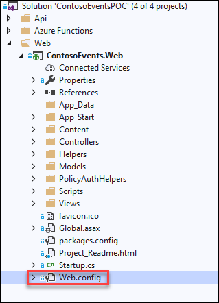

2.  For the apimng:BaseUrl key, enter the base URL of the API you created in the API Management Publisher Portal (Exercise 5, Task 1, Step 5), such as <https://contosoevents-SUFFIX.azure-api.net/events/>

    > **Note**: Make sure to include a trailing "/" or the exercise will not work.

3.  For the apimng:SubscriptionKey key, enter the subscription key you revealed in API Management developer portal (Exercise 5, Task 2, Step 4).

4.  Save Web.config. You should have values for two of the API Management app settings.

    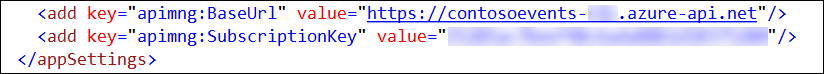

### Task 2: Running the web app and creating an order

In this task, you will test the web application calls to API Management by creating an order through the UI.

1.  Using Solution Explorer in Visual Studio, expand the Web folder, then right-click the ContosoEvents.Web project, select **Debug**, and then **Start new instance**.

    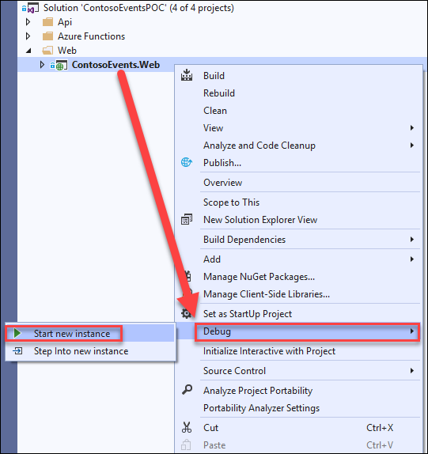

2.  If prompted about whether you would like to trust the IIS Express SSL certificate, select **Yes**, then select **Yes** again at the Security Warning prompt.

    

3.  If you receive a warning in the browser that "Your connection is not private," select **Advanced**.

    

4.  Under Advanced, select **Proceed to localhost (unsafe)**.

    

5.  When the application launches you will see the website home page as shown in the following screen shot.

    

6.  Note the event presented on the home page has an **Order tickets now** button. Select that to place an order.

7.  Choose the number of tickets for the order, and then scroll down to see the billing fields.

    

8.  Enter values into the empty fields for your email, first name, last name, and Cardholder name.

    

9.  Select **Place Order**.

10. Once the order is queued for processing, you will be redirected to a results page as shown in the following screen shot. It should indicate Success and show you the order id that was queued as confirmation.

    

11. Close the web browser to stop debugging the application.

### Task 3: Publish the web app

In this task, you will publish the web application to Azure.

1.  From the Visual Studio Solution Explorer, right-click ContosoEvents.Web, and select Publish.

    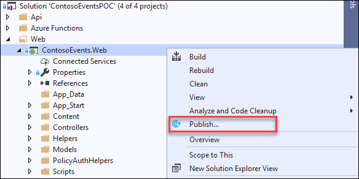

2.  Select the App Service option, choose Select Existing, then select **Publish**.

    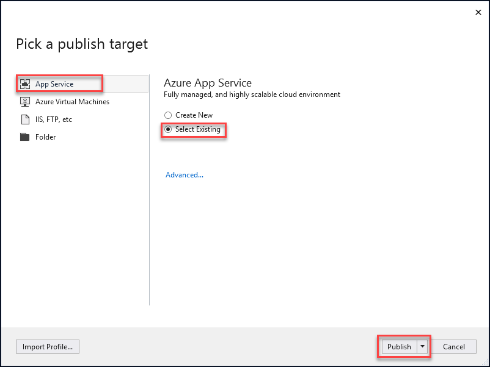

3.  You may be prompted to log in to your Microsoft Account with access to the subscription where you created the resources for this hands-on lab. After logging in, you can select the subscription in the App Service screen.

4.  From the list below, expand the Resource Group you created previously (hands-on-lab), and select the web app **contosoeventsweb-SUFFIX**. Select **OK**.

    

5.  If the Publish does not start automatically, select Publish next to the Web Deploy publishing profile.

    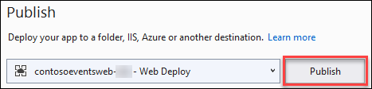

6.  When publishing is complete, your browser will launch, and navigate to the deployed web app home page. You can optionally submit another order to validate functionality works as in Task 2.

## After the hands-on lab

Duration: 10 minutes

In this exercise, attendees will deprovision any Azure resources that were created in support of the lab. You should follow all steps provided after attending the Hands-on lab.

### Task 1: Delete the resource group

1.  Using the Azure portal, navigate to the Resource group you used throughout this hands-on lab by selecting Resource groups in the side menu.

2.  Search for the name of your research group, and select it from the list.

3.  Select Delete in the command bar, and confirm the deletion by re-typing the Resource group name, and selecting Delete.